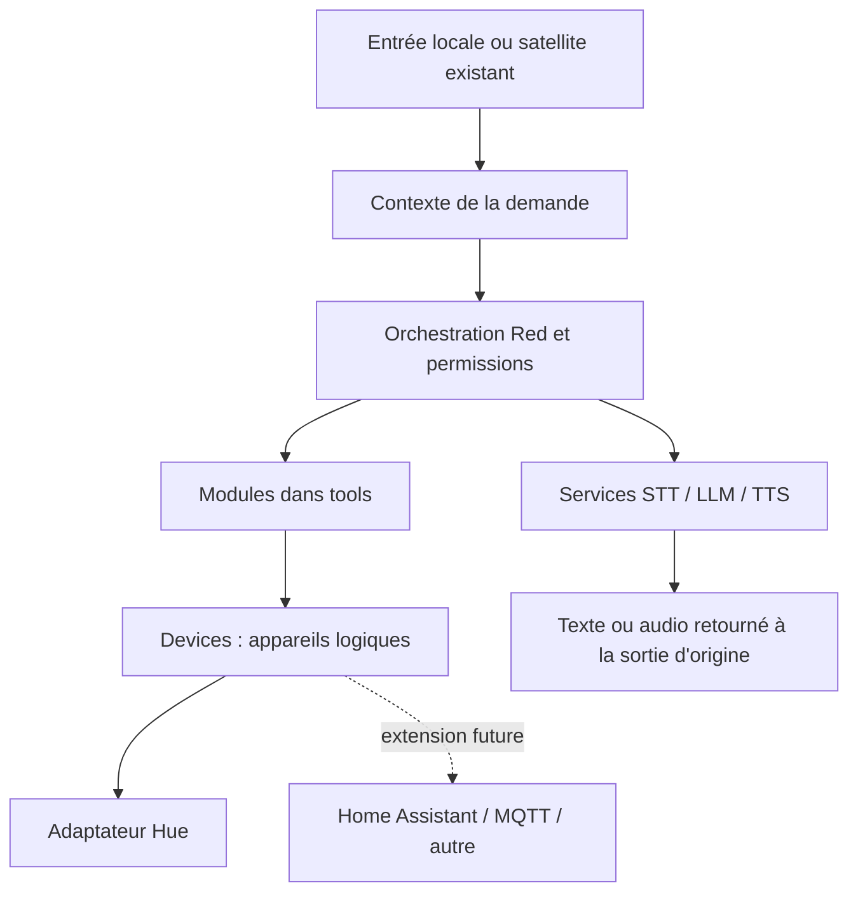

# Architecture locale préparée pour plusieurs pièces

Red garde la conversation, la mémoire, les intentions, les permissions et
l'orchestration. Ce changement ne déploie aucun serveur domotique, satellite,
broker MQTT ou nouvelle API. Le point d'entrée satellite déjà présent dans le
projet conserve son protocole et ses règles d'activation.

## Responsabilités

| Concept | Emplacement | Responsabilité |
|---|---|---|
| Modules | `tools/`, chargés par `core.registre` | Fonctionnalités, intentions, confirmations et réponses utilisateur |
| Services | `services/` et moteurs existants `core/llm.py`, `core/tts.py` | STT, TTS, LLM ; contrat d'embeddings réservé pour plus tard |
| Intégrations | `integrations/` | Traduction vers un système externe ; premier pilote extrait : Hue |
| Devices | `core/devices.py` | Identifiants stables, capacités, résolution des pièces et commandes abstraites |
| Composition | `core/maison.py` | Configuration et association des appareils aux intégrations |
| Entrées/sorties | `jarvis14.py`, entrée satellite existante | Microphone, lecture audio, interruption et transport |

`tools/` constitue le répertoire des **modules** actuel : il n'est pas renommé,
pour conserver l'auto-découverte et les imports. Les outils historiques Spotify,
Alexa, etc. restent compatibles ; leur extraction progressive suivra le modèle
de Hue. Il n'y a pas encore de pilote Home Assistant ni MQTT.



## Appareils et pièces

Une pièce physique n'est **pas** une zone de mémoire protégée. Aucun accès à une
zone de mémoire n'est accordé par l'appartenance à une pièce.

```yaml
execution:
  user_id: local
  device_id: main_pc
  room_id: salon

rooms:
  salon:
    satellite: Red_salon
    devices:
      light: salon.light

devices:
  salon.light:
    kind: light
    name: Lumière du salon
    integration: hue
    address: "3"       # véritable groupe du pont Hue, à adapter
    room_id: salon
```

Les clefs contenant un point sont des identifiants complets : `salon.light` ne
signifie pas une sous-section YAML. `rooms.*.devices` associe un rôle à un
identifiant ; cette association fait autorité. Chaque appareil utilisé doit
exister dans `devices`. `speaker`, `sensor`, `computer`, `screen` ou `television`
peuvent être représentés de la même façon avec leurs capacités et leur futur
pilote ; leur contrôle n'est pas ajouté ici.

```python
from core import devices
devices.turn_on("salon.light")
```

Le module lumière utilise `Devices.resolve/select` et `perform` pour allumer,
éteindre, régler la luminosité ou la couleur. L'adaptateur reçoit un `Device`,
une action, des paramètres neutres et le contexte. Les noms de services HA,
topics MQTT et unités Hue ne doivent pas sortir de l'intégration.

Pour ajouter un pilote, implémenter `DeviceIntegration.execute`, puis l'enregistrer
au point de composition avec `core.maison.register_integration`. Une intégration
inconnue ou une capacité absente produit une erreur explicite, sans repli sur
un appareil différent. Les intégrations sont enregistrées par du code de confiance,
pas par import arbitraire depuis le fichier YAML.

Sans nouveau catalogue, la découverte des groupes Hue et les commandes anciennes
restent disponibles. Avec un catalogue, « toutes » cible les lumières explicitement
déclarées. Un groupe de commandes physiques n'est pas transactionnel : un échec
après une première réussite indique les appareils déjà commandés.

## Contexte d'exécution

`ExecutionContext` est immuable et contient `user_id`, `session_id`, `room_id`,
`device_id`, `satellite_id`, `source`. Le PC utilise `local`, une session propre
au processus, `main_pc` et aucune pièce tant qu'elle n'est pas configurée.
`context=` est accepté par l'entrée locale `traiter`; les outils lisent `current()`.

```python
from core.contexte import ExecutionContext, use
from core.maison import devices

with use(ExecutionContext(room_id="salon", satellite_id="Red_salon")):
    catalogue = devices()
    appareil = catalogue.resolve("ici", "light")
    catalogue.turn_off(appareil.id)
```

Sans pièce connue, « ici » demande de préciser la pièce, jamais « toute la maison ».
Les commandes simples « éteins la lumière ici » sont routées vers le module
lumière quand le catalogue spatial est configuré.

Les `ContextVar` isolent les tâches asynchrones. Pour une tâche `threading.Thread`
ou un pool, capturer `bind(fonction)` **dans le thread appelant**, une fois par
tâche. La boucle de réponse locale le fait déjà. Les confirmations du registre
sont attachées à la session et à l'appareil d'origine, et conservent le contexte
initial jusqu'à leur exécution.

Une connexion du satellite existant possède une session unique. Sa pièce vient
de `rooms.*.satellite`, sinon de son ancienne configuration `piece`, côté serveur.
Le contexte n'utilise pas une pièce arbitraire fournie par une trame cliente.
L'identité utilisateur y reste `anonymous`, car un jeton de satellite identifie
un appareil, pas la personne qui parle. Le pont iPhone a également un contexte
séparé sans pièce locale implicite.

**Ces identifiants ne constituent pas une authentification ni une autorisation.**
Le futur serveur devra authentifier les équipements, identifier les utilisateurs
et vérifier les droits indépendamment du contexte transmis. La mémoire privée
reste locale ; cette étape ne l'expose pas aux satellites et ne remplace pas sa
validation ni son chiffrement.

## Services et audio

Les contrats `STTService`, `TTSService`, `LLMService`, `EmbeddingService` acceptent
un contexte explicite. `services/existing.py` adapte les moteurs actuels sans
modifier leurs paramètres. Les appels LLM locaux et satellites utilisent cet
adaptateur ; le chemin audio du satellite existant utilise aussi STT/TTS.

`AudioData` contient des octets PCM 16 bits little-endian, une fréquence et un
nombre de canaux. Aucun contrat de moteur ne présuppose un périphérique physique.
Le TTS **retourne** l'audio ; l'entrée/sortie choisit où le jouer. L'adaptateur
Whisper actuel demande du mono 16 kHz. Le repli Windows reste local au PC.
Les embeddings n'ont ni moteur, ni stockage, ni index activé ici.

Une future entrée distante pourra authentifier une requête, construire son contexte,
fournir l'audio au STT, appeler l'orchestrateur puis renvoyer texte ou audio au
satellite. Elle pourra remplacer les adaptateurs de service sans déplacer la
logique métier. La conversation locale, ses interruptions et certains anciens
outils comportent encore un état propre au PC : cette préparation n'est pas une
promesse de serveur multi-utilisateur déjà prêt à être exposé.

## Événements

`Event` expose une enveloppe JSON versionnée avec `event_id`, `type`, `source`,
`satellite_id`, `room_id`, `device_id`, `user_id`, `session_id`, `timestamp` UTC et
`payload`. Le payload est copié par sérialisation à la création ; les objets
Python vivants, données binaires et nombres non JSON sont refusés.

`LocalEventBus` publie en mémoire, sans file persistante, replay ou réseau. Les
abonnés ne doivent pas bloquer. Un abonné défaillant n'annule pas une action déjà
exécutée et n'empêche pas les autres abonnés de recevoir l'événement.
`EventPublisher.publish` permettra d'injecter un transport futur.

Seules les commandes d'appareil réussies publient actuellement un événement,
contenant l'identifiant cible et l'action. Les mots de passe, conversations,
souvenirs et valeurs déchiffrées ne sont jamais raccordés à ce bus. L'invalidation
locale sécurisée des aperçus mémoire conserve son canal spécialisé.

Avant tout transport MQTT/WebSocket : définir authentification, chiffrement du
transport, contrôle d'accès, déduplication via `event_id`, gestion des délais et
ordre des événements. Aucun événement reçu du réseau ne devra déclencher une
commande physique sans repasser par les permissions de Red.

## Place future de Home Assistant

Home Assistant sera un adaptateur de catalogue, d'état, de capteurs, d'appareils
et de scènes. Il ne devient ni le stockage de la mémoire, ni le gestionnaire
des utilisateurs de Red, ni son moteur d'intentions. Un appareil logique pourra
changer d'intégration en configuration sans modifier les modules qui l'utilisent.

## Vérification

`tests/test_architecture_distribuee.py` couvre l'isolation de sessions et threads,
la résolution « ici », le remplacement d'un pilote, les erreurs sans action
involontaire, la compatibilité Hue, l'enveloppe JSON et les services sans matériel.
La suite générale vérifie aussi les confirmations, la mémoire et la voix existantes.
Les appareils réels et transports futurs ne sont pas requis par ces tests.
